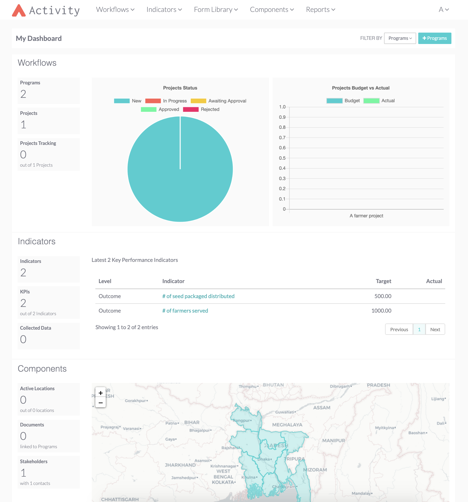

<br/>
<br/>
<p align="center">
  
</p>

<br/>
<p align="center">
  <a href='https://travis-ci.org/hikaya-io/activity.svg?branch=dev'></a>
  <a href="https://codecov.io/gh/hikaya-io/activity"></a>
  <a href='https://github.com/hikaya-io/activity/workflows/Activity/badge.svg'></a>
</p>

<br/>
<p align="center">
  <i>A modern way for nonprofits to manage project activities and indicator results.<br/>Try out Activity using our hosted version at <a href="https://hikaya.io">hikaya.io</a>.</i>
  <br/>
  <br/>
  
</p>
<p align="center">
  <a href="https://spectrum.chat/hikaya" rel="nofollow"></a>
</p>

This is the source code that runs the [**Activity**](https://hikaya.io/index#content4-8) application. If you want to use Activity then you don't need to run this code, we offer a hosted version of the app at [activity.hikaya.app](https://activity.hikaya.app).

If you'd like to run your own copy of Activity or contribute to its development then this is the place for you.

<!-- ## Configuration
## To deploy changes in activity servers
Once all your changes have been committed to the repo, and before pushing them, run:
`. travis.sh` -->

<br/>
<br/>

# Local Setup

**Note**: You should use `Python 3.7.5` for this project, meaning you may need to use `python3` or `pip3` in the following instructions (you can use the package manager on your OS, brew for mac, to install python 3).

Open up your terminal and follow the instructions listed below.

See [these instructions for additional information](#extra-information).

## Clone the github repository

Navigate to the folder you want the repository to be stored in.

Run the following command:

```bash
$ git clone --branch dev https://github.com/hikaya-io/activity.git
```

Once cloned, navigate to the cloned repository with:

```bash
$ cd activity
```

or similar for your OS.

## Setting up on Virtual Environment
You can setup virtual environment either using `virtualenv` or `pipenv`.

### Using virtualenv
#### Install virtualenv

```bash
$ pip install virtualenv
```

#### Create virtualenv

```bash
$ virtualenv <myvirtualenvironmentname>
```

- by default it should prevent virtualenv from seeing your global packages
- . <myvirtualenvironmentname>/bin/activate allows us to just use pip from the command-line by adding to the path rather than the full path.

#### Activate virtualenv

```bash
$ source <myvirtualenvironmentname>/bin/activate
```

for Windows users:

```bash
$ source <myvirtualenvironmentname>/script/activate
```

### Using pipenv
#### Install pipenv
```bash
$ pip install pipenv
```

#### Create and activate virtual environment
```bash
$ pipenv shell
```

### Install requirements
Once your virtual environment is running, install the requirements.

```bash
$ pip install -r requirements.txt
```

### Create local copy of config file

Copy the example config:

```bash
$ cp activity/settings/local-sample.py activity/settings/local.py
```

### Modify the config file

Edit database settings activity/settings/local.py as shown below.

We will change the `ENGINE` parameter to the default value for postgres (although you can also user MySQL or Sqllite3 which is out-of-the-box supported by Django). We also need to add a default database name in the `NAME` option.

Since postgres is the preferred database for this project, we have provided extra instructions to help you set it up. These can be viewed [here](#postgresql-help).

```yaml
47 DATABASES:
48  'default': {
49    #'ENGINE': 'django.db.backends.postgresql', # Alternatives: 'postgresql', 'postgresql_psycopg2', 'mysql', 'sqlite3' or 'oracle'.
50    'ENGINE': "django.db.backends.postgresql"
51    'NAME': os.environ.get('ACTIVITY_CE_DB_NAME', 'mydatabasename'), # replace mydatabasename here with the name of your database
52    # The following can be left unchanged for local use:
53    'USER': os.environ.get('ACTIVITY_CE_DB_USER', ''),
54    'PASSWORD': os.environ.get('ACTIVITY_CE_DB_PASSWORD', ''),
55    'HOST': os.environ.get('ACTIVITY_CE_DB_HOST', ''),
56    'PORT': os.environ.get('ACTIVITY_CE_DB_PORT', ''),
```

### Set up DB

```bash
$ python manage.py migrate
```

### Create super user (first time only)

```bash
$ python manage.py createsuperuser
```

## Run fixtures

### Add authorization groups

```bash
$ python manage.py loaddata fixtures/auth_groups.json
```

### Add countries
```bash
$ python manage.py loaddata fixtures/countries.json
```

### Add sectors
```bash
$ python manage.py loaddata fixtures/sectors.json
```

### Run the app locally

If you're using more then one settings file change manage.py to point to local or dev file first.

```bash
$ python manage.py runserver
```

This will run the server on http://127.0.0.1:8000 (Don't open the link in your browser yet). You can configure the host and port as needed.

### Create an activity user

Once you have created your user account, you need to create an `activity user` that is linked to this user account.

Go to http://127.0.0.1:8000/admin and sign in using your superuser account. Under the `Workflow` model, you'll find `Activity users`. Create a new activity user making sure you associate your user under the `User` attribute.

### Open the dashboard

Before launching the dashboard on http://127.0.0.1:8000, you need to log out of the admin account first.
This is to avoid an `AttributeError`. 

Use the same admin credentials on the dashboard login page.

## Set up locally using Docker
Ensure docker is installed on your local computer!

### Build the docker image
```bash
$ docker-compose build
```

### Run the container
```bash
$ docker-compose up 
```
you can add the `-d` flag to run the container in detached mode

### Run and Build at the same time
```bash
$ docker-compose up -d --build

If docker is exiting due to postgres connection issues. Stop your local postgres instance, then rerun the above command

```

### Create Superuser
```bash
$ docker-compose exec web python manage.py createsuperuser
```

### Create 'Activity users'
- Before logging in to the application you will need to go to the admin console (http://localhost:8000/admin/).
- Navigate to `Workflow > Activity users` and add an Activity user.
- Make to sure to select the superuser name you created earlier.

### Open the dashboard
- Please make sure to log out of the admin console to avoid `AttributeError`.
- Go back to the main page to log in and create an organization to access the main dashboard (http://localhost:8000/)

### To run any other django commands
```bash
$ docker-compose exec web python manage.py [operation]
```
The `operation` in this case can be: `makemigrations`, `migrate`, `collectstatic` etc

<br/>
<br/>

# Extra information

## Postgresql help

### Install

On MacOS:

```bash
$ brew update
$ brew install postgresql
$ initdb /usr/local/var/postgres
$ pg_ctl -D /usr/local/var/postgres start
$ createdb <mydatabasename>
```
On Windows:
- Download and install the latest stable installer for PostgreSQL
- You can use the SQL Shell that comes along with the application to run the following commands
- To create a database run the command
```bash
$ create database <mydatabasename>;
```

### Manage

```bash
pg_ctl -D /usr/local/var/postgres start # to start
pg_ctl -D /usr/local/var/postgres stop # to stop
```

## MySQL help

### Django migrate access denied

If you get access denied, it means you need to modify the config file and write your Mysql username and password in the file

### Path issue

To fix any issues related to your path that may come up during the django set up, run:

```bash
$ export PATH=$PATH:/usr/local/mysql/bin
```

or specify the path you have to your installed mysql_config file in the bin folder of mysql

If you want this environment variable to be automatically set, please include it in your bash_profile or bashrc file.

### Django settings file

Replace user and password by your Mysql username and password

### Set up Django's MySQL backing store

```sql
CREATE DATABASE 'activity';
CREATE USER 'root';
GRANT ALL ON activity.* TO 'root'@'localhost' IDENTIFIED BY 'root';
```

_NB:_ When you use these SQL queries, beware of not writing the quotes.

## Install non-python dependencies

1. **GDAL**

On MacOs:

```bash
$ brew install gdal
```

On Windows:
- You will need to download gdal core and gdal installer for your version of python.
- Please read the following [instructions](https://pypi.org/project/GDAL/#windows) on how to properly install and test gdal.

2. **Pango**

On MacOs:

```bash
$ brew install pango
```

On Windows:
- You will need Pango and Cairo for the application to run.
- The runtime installer can be found [here](https://github.com/tschoonj/GTK-for-Windows-Runtime-Environment-Installer/releases)
- Download and install GTK+-3. 

<br/>
<br/>

# Contributing
Activity is built and maintained by the team at [Hikaya](https://hikaya.io/team). We are always looking for a fresh set of :eyes: who want to contribute to **Activity**. Feel free to checkout our [contribution page](./CONTRIBUTING.md) or learn more about our [development process](https://team.hikaya.io/start/development-process.html). You can reach out by creating an issue and we'll help you get started!
